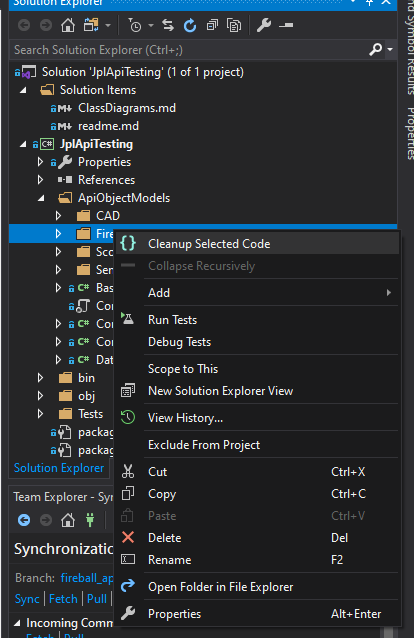

# Project 3 - Api Group Testing

### A framework for testing [JPL’s SSD (Solar System Dynamics) and CNEOS (Center for Near-Earth Object Studies) API](https://ssd-api.jpl.nasa.gov/)

#### Please note: Though the main submission exists in the "master" branch, please find the combined project within branch "split_up_projects"

## The Project

~ ***[Please refer to the Github Project board here](https://github.com/tomporter1/ApiGroupTesting/projects/1)*** ~
<br/>
**Timeframe**: Mon: Jul-13-2020 - Fri: Jul-17-2020
<br/><br/>


<br/><br/>

### [Who's on each API](https://github.com/tomporter1/ApiGroupTesting/projects/1#card-41762088)?<br/>

|API|Name|Github Profile|
|---|----|---------------|
|[**Sentry**](https://ssd-api.jpl.nasa.gov/doc/sentry.html)|Sunny|[Sunny-Sahota](https://github.com/Sunny-Sahota)|
|[**Fireball**](https://ssd-api.jpl.nasa.gov/doc/fireball.html)|Kieran|[BrujoCervino](https://github.com/BrujoCervino)|
|[**Scout**](https://ssd-api.jpl.nasa.gov/doc/scout.html)|Thamish|[Thamish](https://github.com/Thamish)|
|[**CAD**](https://ssd-api.jpl.nasa.gov/doc/cad.html)|Tom|[TomPorter1](https://github.com/TomPorter1)|
|[**SBDB**](https://ssd-api.jpl.nasa.gov/doc/cad.html)|Tom & Thamish***¹***|[TomPorter1](https://github.com/TomPorter1) & [Thamish](https://github.com/Thamish)|

***¹*** -  Tom wrote the [**SBDB**](https://ssd-api.jpl.nasa.gov/doc/cad.html) test framework and a few tests for it, Thamish wrote the majority of the tests for it.
<br/>

### [Who's Scrum Master on which Day(s)](https://github.com/tomporter1/ApiGroupTesting/projects/1#card-41798679)?

|Day|Name|
|---|----|
|***Mon:Jul-13-20***|Tom|
|***Tue:Jul-14-20***|Thamish|
|***Wed:Jul-15-20***|Sunny|
|***Thu:Jul-16-20*** - <br/> ***Fri:Jul-17-20***|Kieran|

<br/>

### Who Has an Extra Role(s)?

|Name|Assignment|
|----|----------|
|**Kieran**|Head of documentation (markdown files & project board)|
|**Tom**|Github project admin|

<br/>

### 1 - Goals and Definition of Done<br/><br/>


<br/><br/>

☄️ [**Project Goal**](https://github.com/tomporter1/ApiGroupTesting/projects/1#card-41844014)

☄️ **[Project Definition of Done](https://github.com/tomporter1/ApiGroupTesting/projects/1#card-41796263)**
   
☄️ [**Generic User Story Project Definition of Done**](https://github.com/tomporter1/ApiGroupTesting/projects/1#card-41843487)
```
AS A 
Developer
I NEED TO
Develop a series of test frameworks for JPL's SSD & CNEOS API
SO THAT
I can ensure the API is working 
AND
Its sub-APIs are working
THEN 
Other developers at my company can use the API
```

☄️ [**Sprint 1 Goal(s)**](https://github.com/tomporter1/ApiGroupTesting/projects/1#card-41768221)
   
🌠 [**Sprint 1 Definition of Done**](https://github.com/tomporter1/ApiGroupTesting/projects/1#card-41768694)

☄️ [**Sprint 2 Goal(s)**](https://github.com/tomporter1/ApiGroupTesting/projects/1#card-41841844)
   
🌠 [**Sprint 2 Definition of Done**](https://github.com/tomporter1/ApiGroupTesting/projects/1#card-41841793)

☄️ [**Sprint 3 Goal(s)**](https://github.com/tomporter1/ApiGroupTesting/projects/1#card-41843123)

🌠 [**Sprint 3 Definition of Done**](https://github.com/tomporter1/ApiGroupTesting/projects/1#card-41843668)

<br/>

### 2 - Sprint Breakdown and Reviews<br/><br/>

|Sprint|Timeframe|Done?⬜️✅|Screenshot Start [Files](https://github.com/tomporter1/ApiGroupTesting/tree/dev/SprintScreenshots)|Screenshot End [Files](https://github.com/tomporter1/ApiGroupTesting/tree/dev/SprintScreenshots)
|------|-----------------------------|---|--|--|
|1|***Mon:Jul-13-20, 1:30PM*** - <br/> ***Tue:Jul-14-20, 1:30PM***|✅|[](SprintScreenshots/Sprint1_Board_Start.png)|[](SprintScreenshots/Sprint1_Board_End.png)|
|2|***Tue:Jul-14-20, 1:30PM*** - <br/> ***Thu:Jul-16-20, 9:30AM***|✅|[](SprintScreenshots/Sprint2_Board_Start.png)|[](SprintScreenshots/Sprint2_Board_End.png)|
|3|***Thu:Jul-16-20, 9:30AM*** - <br/> ***Fri:Jul-17-20, 11AM***|⬜️|[](SprintScreenshots/Sprint3_Board_Start.png)|[](SprintScreenshots/Sprint3_Board_End.png)|

☄️ **Sprint Reviews**
<br/>

 

<br/><br/>
###### 🌠Sprint 1:

_Product owner said_: 
>> "What I'm looking for is starting off with MVP". 
> 
>> "You've gone well beyond [that]".<br/> 
> 
_Product owner requested_:
>> Testing of "use cases"
> 
>> "What are the limits of testing? [Explore testing and what you can test more]"

<br/> 

|Card|Moved into column...|
|-|-|
|[Sprint 1 Goal: Create basic folder structure ☄️✨](https://github.com/tomporter1/ApiGroupTesting/projects/1#card-41768221)|[Notes 🟨](https://github.com/tomporter1/ApiGroupTesting/projects/1#column-9991896)|
|[Sprint 1 Definition of Done ☄️✨](https://github.com/tomporter1/ApiGroupTesting/projects/1#card-41768694)|[Notes 🟨](https://github.com/tomporter1/ApiGroupTesting/projects/1#column-9991896)|
|[Sprint 1 Merge ☄️](https://github.com/tomporter1/ApiGroupTesting/projects/1#card-41824744)|[Done 🟩](https://github.com/tomporter1/ApiGroupTesting/projects/1#column-9991894)|
|[Sprint 1: Api Service class ☄️](https://github.com/tomporter1/ApiGroupTesting/projects/1#card-41769270)|[Done 🟩](https://github.com/tomporter1/ApiGroupTesting/projects/1#column-9991894)|
|[Sprint 1: Api Tests class ☄️](https://github.com/tomporter1/ApiGroupTesting/projects/1#card-41769136)|[Done 🟩](https://github.com/tomporter1/ApiGroupTesting/projects/1#column-9991894)|
|[Sprint 1: Api DTO class ☄️](https://github.com/tomporter1/ApiGroupTesting/projects/1#card-41768989)|[Done 🟩](https://github.com/tomporter1/ApiGroupTesting/projects/1#column-9991894)|
|[Sprint 1: Config Model class ☄️](https://github.com/tomporter1/ApiGroupTesting/projects/1#card-41769156)|[Done 🟩](https://github.com/tomporter1/ApiGroupTesting/projects/1#column-9991894)|
|[Sprint 1: Config Reader class ☄️](https://github.com/tomporter1/ApiGroupTesting/projects/1#card-41769043)|[Done 🟩](https://github.com/tomporter1/ApiGroupTesting/projects/1#column-9991894)|
|[Sprint 1: Api Manager class ☄️](https://github.com/tomporter1/ApiGroupTesting/projects/1#card-41769217)|[Done 🟩](https://github.com/tomporter1/ApiGroupTesting/projects/1#column-9991894)|

_What happened to any cards left incomplete?_ All were complete.<br/><br/>
###### 🌠 Sprint 2:<br/>

_Product owner said/requested_: 
>> Pleased that we've chieved querying the [current comet over stonehenge](https://en.wikipedia.org/wiki/C/2020_F3_(NEOWISE)), though we need to do more research on it
> 
>> We need to split the testing into separate projects (.csproj files) per API, with a library project for common code (but scrap this if we can't reach it by the presentation)
>
>> It's imperative that we keep our code unbroken (we only need to continue our conventions of morningly commits[[***¹***](https://github.com/tomporter1/ApiGroupTesting/projects/1#card-41824744),[***²***](https://github.com/tomporter1/ApiGroupTesting/projects/1#card-41842349),[***³***](https://github.com/tomporter1/ApiGroupTesting/projects/1#card-41882746)] and continuing to fix all errors/failing tests therein)
>
>> "Don't go wild to get loads of features in-- keep it well documented and in a good state"

<br/> 

|Card|Moved into column...|
|-|-|
|[Sprint 2 Goal: Furthering each test framework☄️✨](https://github.com/tomporter1/ApiGroupTesting/projects/1#card-41841844)|[Notes 🟨](https://github.com/tomporter1/ApiGroupTesting/projects/1#column-9991896)|
|[Sprint 2 Definition of Done ☄️✨](https://github.com/tomporter1/ApiGroupTesting/projects/1#card-41841793)|[Notes 🟨](https://github.com/tomporter1/ApiGroupTesting/projects/1#column-9991896)|
|[Sprint 2: Wed Standup Agenda ☄️](https://github.com/tomporter1/ApiGroupTesting/projects/1#card-41882692)|[Done 🟩](https://github.com/tomporter1/ApiGroupTesting/projects/1#column-9991894)|
|[Sprint 2:  Make tests for invalid API calls ☄️](https://github.com/tomporter1/ApiGroupTesting/projects/1#card-41867649)|[Done 🟩](https://github.com/tomporter1/ApiGroupTesting/projects/1#column-9991894)|
|[Sprint 2:  Make tests for  API header responses ☄️](https://github.com/tomporter1/ApiGroupTesting/projects/1#card-41881884)|[Done 🟩](https://github.com/tomporter1/ApiGroupTesting/projects/1#column-9991894)|
|[Sprint 2 Merge (1 of 2) ☄️](https://github.com/tomporter1/ApiGroupTesting/projects/1#card-41842349)|[Done 🟩](https://github.com/tomporter1/ApiGroupTesting/projects/1#column-9991894)|
|[Sprint 2: Kieran: Make a base class of the CallManager ☄️](https://github.com/tomporter1/ApiGroupTesting/projects/1#card-41867675)|[Done 🟩](https://github.com/tomporter1/ApiGroupTesting/projects/1#column-9991894)|
|[Sprint 2: Track the current comet over stonehenge ☄️](https://github.com/tomporter1/ApiGroupTesting/projects/1#card-41900994)|[Done 🟩](https://github.com/tomporter1/ApiGroupTesting/projects/1#column-9991894)|
|[Sprint 2: Assign someone to SBDB API ☄️](https://github.com/tomporter1/ApiGroupTesting/projects/1#card-41901322)|[Done 🟩](https://github.com/tomporter1/ApiGroupTesting/projects/1#column-9991894)|
|[Sprint 2 Merge (2 of 2) ☄️](https://github.com/tomporter1/ApiGroupTesting/projects/1#card-41882746)|[Done 🟩](https://github.com/tomporter1/ApiGroupTesting/projects/1#column-9991894)|
|[Sprint 2: Thu Standup Agenda ☄️](https://github.com/tomporter1/ApiGroupTesting/projects/1#card-41951244)|[Done 🟩](https://github.com/tomporter1/ApiGroupTesting/projects/1#column-9991894)|

_What happened to any cards left incomplete?_ Card [Sprints 2-3:  Have written as many tests as you can think of for your API ☄️](https://github.com/tomporter1/ApiGroupTesting/projects/1#card-41867743) remained in [In Progress](https://github.com/tomporter1/ApiGroupTesting/projects/1#column-9991889), because only Tom and Thamish had exhausted the potential of their tests for their repectively original given APIs ([**CAD**](https://ssd-api.jpl.nasa.gov/doc/cad.html) and [**Scout**](https://ssd-api.jpl.nasa.gov/doc/scout.html))<br/><br/>
###### 🌠 Sprint 3:<br/>

_Product owner said/requested_: 
> [Product owner was absent from this review]

|Card|Moved into column...|
|-|-|
|[Sprint 3 Definition of Done ☄️✨](https://github.com/tomporter1/ApiGroupTesting/projects/1#card-41843668)|[Notes 🟨](https://github.com/tomporter1/ApiGroupTesting/projects/1#column-9991896)|
|[Sprint 3 Goal: Refine, Refactor, Unify ☄️✨](https://github.com/tomporter1/ApiGroupTesting/projects/1#card-41843123)|[Notes 🟨](https://github.com/tomporter1/ApiGroupTesting/projects/1#column-9991896)|
|[Sprint 3 Merge ☄️](https://github.com/tomporter1/ApiGroupTesting/projects/1#card-42044361)|[Done 🟩](https://github.com/tomporter1/ApiGroupTesting/projects/1#column-9991894)|
|[Sprint 3 - Need to update documentation to reflect SBDB assignments by Tom and Thamish ☄️](https://github.com/tomporter1/ApiGroupTesting/projects/1#card-41973731)|[Done 🟩](https://github.com/tomporter1/ApiGroupTesting/projects/1#column-9991894)|
|[Sprint 3: Inherit from base classes in prep. for migrating to per-project Service Object Models ☄️](https://github.com/tomporter1/ApiGroupTesting/projects/1#card-41978637)|[Done 🟩](https://github.com/tomporter1/ApiGroupTesting/projects/1#column-9991894)|

_What happened to any cards left incomplete?_

### 3 - Sprint And Project Retrospectives<br/><br/>

 
<br/>

*Information useful to steal for the next project*

☄️ **Sprint Retrospectives**

###### 🌠Sprint 1:<br/>

|Name|What Went Well?|Improvements|Action Plan|
|-|-|-|-|
|**(CAD) Tom**|Getting the initial frameworks set up so we could start working on our own sections|Have set standards and conventions to minimise conflicts in the future|Have set goals for each sprint that are agreed on as a group and refactor any code that can be shared between the different frameworks|
|**(Fireball) Kieran**|Setting up the framework quickly and using Github efficiently so the team could quickly get started on their own API test framework. Good use of documentation and project management so we were able to stay focussed|Need to get as much Github practice as possible to stay updated|Need to follow the agreed sprint cards on the project board|
|**(Scout) Thamish**|Worked well as a team. Achieved sprint goal|Time management|In the next sprint Thamish hopes to add more tests to the framework|
|**(Sentry) Sunny**|Was able to construct the base framework for our test project, minimising future risks by creating separate frameworks for each API. Was then able to run basic Tests against the Sentry API. Utilised branches with each milestone of the project in order to have a well-defined history of progress|Familiarised with how GitHub is integrated within Visual Studio|Continue to work closely with team when merging local branches in order to minimise the risk of errors within the project|

###### 🌠Sprint 2:<br/>

|Name|What Went Well?|Improvements|Action Plan|
|-|-|-|-|
|**(CAD) Tom**|Having the framework already set up and working allowed Tom to solely focus on writing tests as the API object model was already set up|Make the API frameworks use shared code modules. This will simplify them and make the easier to use|Add tests to his own framework methods to insure that they work as expected|
|**(Fireball) Kieran**|Worked well within the team. Finished all Sprint 2 cards assigned to him. Managed the project board and readme for extensive and useful documentation |Needs to make his code less ugly and hard-coded during Sprint 3. Needs to commit more often to source control.|Plans to make his codebase take advantage of the library code more, for future-proofness (lessening possibility of bugs via uselessly different implementations of the same code). Plans to test his own code to ensure it is robust enough |
|**(Scout) Thamish**|Worked well as a team, achieved sprint goal|Minimise conflicts|In the next sprint Thamish hopes to refactor all of his code and prepare the presentation|
|**(Sentry) Sunny**|Completed most basic tests for each Sentry API including header responses. Refactored code to future proof his solution. This allowed Sunny to meet requirements set by stakeholders such as separating each type of API into separate projects|Commit more often in order to have more points of recovery within the source control|To test and refactor code further in order to optimise the solutions created. For example only accepting specific inputs within methods to make code more robust|

###### 🌠Sprint 3:<br/>

|Name|What Went Well?|Improvements|Action Plan|
|-|-|-|-|
|**(CAD) Tom**|Pull requests and mergers from the dev branch have gone a lot smoother as we have become more familiar with GIT and GitHub. Also splitting up the projects into their own separate projects went surprisingly well as we put considerable effort into minimising conflicts and dependencies at the start of the project|For the different frameworks to use generalised code to simplify them and have them being less hard coded to specific use cases|If this project were to continue past the prototype stage, then it would be good to include more APIs and to generalise the framework more|
|**(Fireball) Kieran**|Great documentation: explains the project well.|Wish he had focussed more on the code in this sprint|If the project were to be worked on past the prototype week, Kieran would refine his codebase more and test his own functions more.|
|**(Scout) Thamish**|Worked well as a team<br/>Achieved sprint goal<br/>Refactored code<br/>Achieved stakeholder requirements|Minimise conflicts<br/>Framework needs to use more shared code modules|Test more APIs|
|**(Sentry) Sunny**|Was able to test the error responses given for each API when invalid data was given to methods. Implemented tests for specific argument exceptions when sending invalid data given to sentry service methods|Make services more robust when accepting input data, by defining specific exceptions|To refactor the sentry config so that it inherits from a shared parent class between all APIs|


☄️ **Project Retrospective**

|Name|What have you learned?| What would you do differently next time?| What would you do next?|
|-|-|-|-|
|**(CAD) Tom**|||
|**(Fireball) Kieran**|Extensive documentation<br/>Quickly was able to write Fireball codebase<br/>Learnt a lot about source control<br/>|Could have tested my own code more<br/>Could have tested for exceptions<br/>Could have focussed more on expanding my codebase|If the project were to continue past the prototype stage, Kieran would test more APIs and write tests for more edge cases (negative numbers, overflow etc.)|
|**(Scout) Thamish**|Improved communication and teamwork skills<br>Improved understanding of git and source control|Use more shared code<br/>Manage our time better|Test more Apis<br/>Write more tests for each framework to improve test coverage|
|**(Sentry) Sunny**|During this project Narinder learned how to interact with a source control environment within a team. The daily sprints allowed him to merge often and fully utilise branches to separate features within the project. He then utilised inheritance by extending from base classes to keep code dry. A broad set of tests where created against Sentry API|Implement more error handling of methods created when testing data within API, such as testing against a meteor’s mass value|Implement what he learned from the previous API’s to the rest of the available NASA API’s. Create more base classes in order to reduce duplicated code within different API. Create more tests for the comet over stone hedge with a larger range of API’s to get a larger set of data| 

## Code

 
<br/><br/>


### Projects (within master)

| .csproj | Purpose |
|---------|---------|
|***JplApiTesting***|Everything (so far)|

### Branches

|Name|Purpose|
|--|--|
|***cad_api_tests***|Testing CAD API|
|***fireball_api_tests***|Testing Fireball API|
|***sbdb_api***|Service object model for SBDB testing|
|***sbdb_api_tests***|Testing SBDB API|
|***scout_api_tests***|Testing Scout API|
|***sentry_api_tests***|Testing Scout API|
|***dev***|For developers to combine builds|
|***master***|Master branch: only ever contains working code|
|***split_up_projects***|Didn't have time to implement this into the codebase, but this contains the project split into library and implementation .csproj files|
|***class_diagrams***|Contains class diagrams|

### Class Diagrams

|Name|Purpose|Picture|Location|
|-|-|-|-|
||||

### Recommended Visual Studio Extensions

☄️ ***[CodeMaid](https://marketplace.visualstudio.com/items?itemName=SteveCadwallader.CodeMaid)*** ~ Quicker refactoring <br/>
```
Agreed CodeMaid workflow:
1. Click your own folder -> Cleanup Selected Code
2. Do this for both your Service Object Model(s) and test(s)
``` 

[](DocumentationImages/AgrdCodMaiWorkflow.png) <br/>
☄️ ***[SideScroller](https://marketplace.visualstudio.com/items?itemName=drewnoakes.SideScroller)*** ~ Allows horizontal scrolling with ```SHIFT + MOUSEWHEEL```: saves lots of time <br/>
☄️ ***[Markdown Editor](https://marketplace.visualstudio.com/items?itemName=MadsKristensen.MarkdownEditor)*** ~ Allows live previewing and syntax highlighting of Github-flavoured markdown (what you're reading right now) <br/>

### Agreed conventions (made only when needed)

 
<br/><br/>

☄️ Underscores for private members ```private int _myInt;```<br/>
☄️ Leave Json classes formatted as they come (except from making arrays into List\<T> ```int[] json_objects``` -> ```List<int> json_objects```) <br/>
☄️ All git branches should be all lowercase, with underscores ```KieranFireball``` -> ```kieran_fireball```<br/>
☄️ All tests and test classes should be marked with their author:
<br/>~ **Before** ~
``` C Sharp
public class FireballShould 
{
    [Test]
    public void Contains_ValidString() { ... }
}
``` 
~ **After** ~
```C Sharp
[Author("K McEvaddy")]
public class FireballShould 
{
    [Test]
    [Author("K McEvaddy")]
    public void Contains_ValidString() { ... }
}
``` 
☄️ Test methods should be named using the [following format (see MethodName_StateUnderTest_ExpectedBehavior)](https://dzone.com/articles/7-popular-unit-test-naming): ```void IsAdult_AgeLessThan18_False()``` <br/>

☄️ Naming conventions for ```public```, ```private``` and ```protected``` fields: <br/>

|Access modifier|Naming Convention|Case|Underscore?⬜️✅|
|---------------|-----------------|----|---------------|
|**public**|```public int MyInt;```|```PascalCase```|⬜️|
|**protected**|```protected int myInt;```|```camelCase```|⬜️|
|**private**|```private int _myInt;```|```camelCase```|✅|
