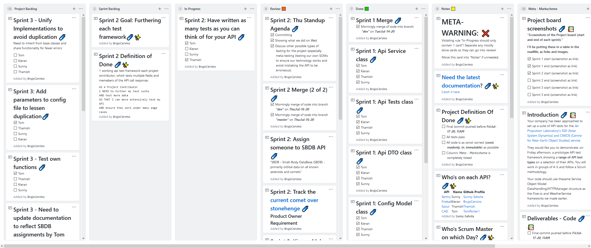

# Project 3 - Api Group Testing

### A framework for testing [JPL’s SSD (Solar System Dynamics) and CNEOS (Center for Near-Earth Object Studies) API](https://ssd-api.jpl.nasa.gov/)

## The Project

~ ***[Please refer to the Github Project board here](https://github.com/tomporter1/ApiGroupTesting/projects/1)*** ~
<br/>
**Timeframe**: Mon: Jul-13-2020 - Fri: Jul-17-2020
<br/><br/>


<br/><br/>

### [Who's on each API](https://github.com/tomporter1/ApiGroupTesting/projects/1#card-41762088)?<br/>

|API|Name|Github Profile|
|---|----|---------------|
|[Sentry](https://ssd-api.jpl.nasa.gov/doc/sentry.html)|Sunny|[Sunny-Sahota](https://github.com/Sunny-Sahota)|
|[Fireball](https://ssd-api.jpl.nasa.gov/doc/fireball.html)|Kieran|[BrujoCervino](https://github.com/BrujoCervino)|
|[Scout](https://ssd-api.jpl.nasa.gov/doc/scout.html)|Thamish|[Thamish](https://github.com/Thamish)|
|[CAD](https://ssd-api.jpl.nasa.gov/doc/cad.html)|Tom|[TomPorter1](https://github.com/TomPorter1)|

<br/>

### [Who's Scrum Master on which Day](https://github.com/tomporter1/ApiGroupTesting/projects/1#card-41798679)?

|Day|Name|
|---|----|
|***Mon:Jul-13-20***|Tom|
|***Tue:Jul-14-20***|Thamish|
|***Wed:Jul-15-20***|Sunny|
|***Thu:Jul-16-20*** - <br/> ***Fri:Jul-17-20***|Kieran|


### 1 - Goals and Definition of Done<br/><br/>


<br/><br/>

☄️ **Project Goal**:
   
☄️ [**Sprint 1 Goal(s)**](https://github.com/tomporter1/ApiGroupTesting/projects/1#card-41768221)
   
☄️ [**Sprint 1 Definition of Done**](https://github.com/tomporter1/ApiGroupTesting/projects/1#card-41768694)

☄️ **Sprint 2 Goal(s)**
   
☄️ **Sprint 3 Goal(s)**
   
☄️ **[Project Definition of Done](https://github.com/tomporter1/ApiGroupTesting/projects/1#card-41796263)**
   
☄️ **Generic User Story Project Definition of Done**
```
AS A 
User
I NEED TO
X
SO THAT
Y
```

<br/>

### 2 - Sprint Breakdown and Reviews<br/><br/>

|Sprint|Timeframe|Done?⬜️✅|Screenshot Start [Files](https://github.com/BrujoCervino/CreditCardApplications/tree/master/SprintScreenshots)|Screenshot End [Files](https://github.com/BrujoCervino/CreditCardApplications/tree/master/SprintScreenshots)
|------|-----------------------------|---|--|--|
|1|***Mon:Jul-13-20, 1:30PM*** - <br/> ***Tue:Jul-14-20, 1:30PM***|⬜️|[](SprintScreenshots/Sprint1_Board_Start.png)|[](SprintScreenshots/Sprint1_Board_End.png)|
|2|***Tue:Jul-14-20, 1:30PM*** - <br/> ***Thu:Jul-16-20, 9:30AM***|⬜️|[](SprintScreenshots/Sprint2_Board_Start.png)|[](SprintScreenshots/Sprint2_Board_End.png)|
|3|***Thu:Jul-16-20, 9:30AM*** - <br/> ***Fri:Jul-17-20, 11AM***|⬜️|[](SprintScreenshots/Sprint3_Board_Start.png)|[](SprintScreenshots/Sprint3_Board_End.png)|

☄️ **Sprint Reviews**

### 3 - Sprint And Project Retrospectives<br/><br/>

 
<br/>

*Information useful to steal for the next project*

☄️ **Sprint Retrospective**

☄️ **Project Retrospective**


## Code

 
<br/>


### Projects

| .csproj | Purpose |
|---------|---------|
|***JplApiTesting***|Everything (so far)|

### Class Diagrams

Find class diagrams via [the class diagrams page](ClassDiagrams.md).

### Recommended Visual Studio Extensions

☄️ ***[CodeMaid]()*** ~ Quicker refactoring <br/>
☄️ ***[SideScroller](https://marketplace.visualstudio.com/items?itemName=drewnoakes.SideScroller)*** ~ Allows horizontal scrolling with ```SHIFT + MOUSEWHEEL```: saves lots of time <br/>
☄️ ***[Markdown Editor](https://marketplace.visualstudio.com/items?itemName=MadsKristensen.MarkdownEditor)*** ~ Allows live previewing and syntax highlighting of Github-flavoured markdown (what you're reading right now) <br/>

### Agreed conventions (made only when needed)

☄️ Underscores for private members ```private int _myInt;```<br/>
☄️ Leave Json classes formatted as they come (except from making arrays into List\<T>)
